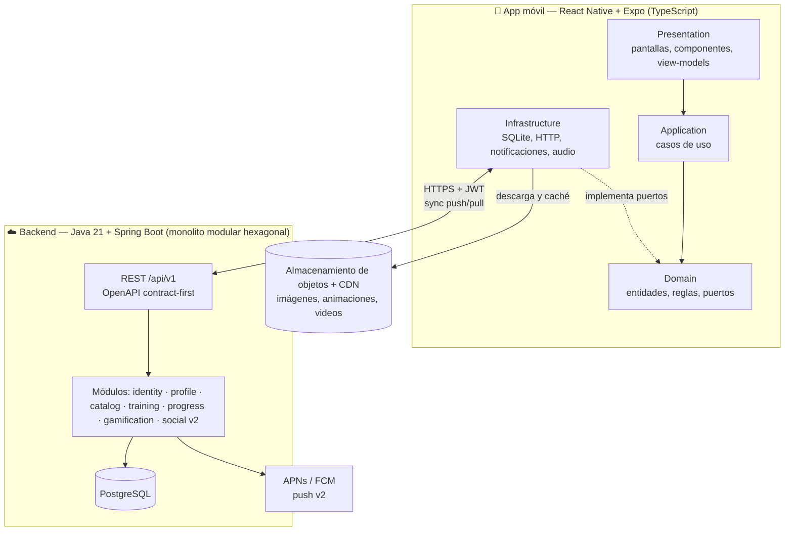
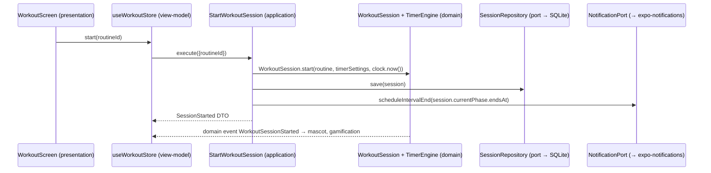
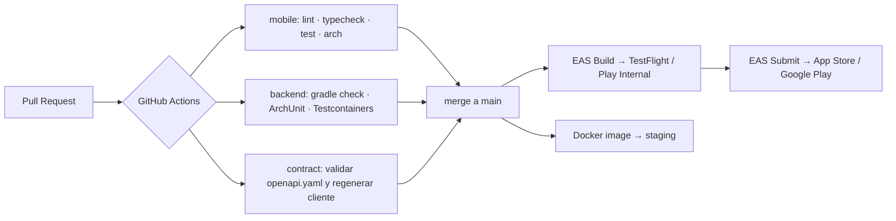

# 04 · Arquitectura

## 1. Vista general



**Estilo:** *offline-first*. El dispositivo ejecuta toda la lógica de entrenamiento con su propia base de datos. El backend autentica, sirve el catálogo, respalda y sincroniza datos, y en v2 es la autoridad de los retos sociales.

## 2. Stack tecnológico propuesto

### Móvil (React Native)
| Necesidad | Tecnología | Motivo |
|---|---|---|
| Framework | **React Native + Expo (managed, SDK estable más reciente)** + TypeScript strict | Una base de código, builds en la nube y publicación con EAS |
| Navegación | Expo Router | Rutas por archivos y deep links (notificaciones, retos) |
| Estado de UI | Zustand | Simple, sin boilerplate y fácil de probar |
| Estado del servidor | TanStack Query | Caché, reintentos y estado offline |
| Base de datos local | expo-sqlite + Drizzle ORM | SQL tipado y migraciones versionadas |
| Formularios y validación | react-hook-form + **zod** | zod también valida los JSON importados (RF-03.08) |
| Notificaciones | expo-notifications | Programación local, acciones y categorías |
| Audio / video | expo-audio / expo-video | Señales del cronómetro y demostraciones |
| Hápticos / pantalla | expo-haptics / expo-keep-awake | RF-05.04 y RF-05.07 |
| Animaciones | react-native-reanimated + lottie-react-native | Mascota, confeti y micro-interacciones a 60 fps |
| Gráficas | victory-native (o equivalente basado en Skia) | Dashboards de progreso |
| Almacenamiento seguro | expo-secure-store | Tokens |
| i18n | i18next + expo-localization | RNF-11 |
| Cliente HTTP | Generado desde OpenAPI (orval u openapi-typescript) | Contrato único con el backend |
| Pruebas | Jest, React Native Testing Library, MSW, fast-check; Maestro para E2E | Ver `07-estrategia-pruebas.md` |
| Calidad | ESLint, Prettier, dependency-cruiser o eslint-plugin-boundaries | Reglas de capas en CI |
| Errores | Sentry | RNF-16 |

### Backend (Java)
| Necesidad | Tecnología |
|---|---|
| Lenguaje / framework | Java 21 (LTS) + Spring Boot 3.x, Gradle (Kotlin DSL) |
| Modularidad | **Spring Modulith**: monolito modular que puede dividirse en microservicios si hace falta |
| Arquitectura por módulo | Hexagonal (puertos y adaptadores) |
| Persistencia | PostgreSQL + Spring Data JPA + Flyway |
| Seguridad | Spring Security (OAuth2 Resource Server con JWT), Argon2id |
| Contrato | OpenAPI 3.1 contract-first (openapi-generator para interfaces) + springdoc para exponerlo |
| Mapeo | MapStruct |
| Pruebas | JUnit 5, AssertJ, Mockito, **Testcontainers**, **ArchUnit**, Spring Modulith Test, JaCoCo |
| Observabilidad | Micrometer + Prometheus, logs JSON, Sentry |
| Despliegue | Docker (contenedor confirmado); proveedor de nube por decidir — D5 diferida a un ADR posterior (ver README §5) |

## 3. Arquitectura de la app móvil

### 3.1 Capas y regla de dependencia
| Capa | Contiene | Puede depender de | Prohibido |
|---|---|---|---|
| `domain` | Entidades, value objects, reglas (RN), puertos (interfaces), eventos de dominio | Nada (solo `shared/domain`) | React, Expo, fetch, SQLite, Date.now() directo |
| `application` | Casos de uso (`StartWorkoutSession`, `ScheduleRoutine`…) y DTOs de entrada y salida | `domain` | UI e infraestructura concreta |
| `infrastructure` | Repositorios SQLite, clientes API, adaptadores de notificaciones, audio y reloj; mappers | `domain`, `application` (puertos) | `presentation` |
| `presentation` | Pantallas, componentes, hooks, view-models (stores Zustand) | `application`, `shared/ui` | Infraestructura concreta (se inyecta) |

### 3.2 Estructura de carpetas (monorepo)
```
fitapp/
├── apps/
│   └── mobile/
│       ├── app/                       # Expo Router: SOLO rutas; delegan en features/*/presentation
│       ├── src/
│       │   ├── composition/           # composition root: crea adaptadores e inyecta casos de uso
│       │   ├── shared/
│       │   │   ├── domain/            # Result, Entity, Id (UUIDv7), Duration, Weight, Clock (puerto), EventBus (puerto)
│       │   │   ├── infrastructure/    # db (drizzle, migraciones), http, secure-storage, event-bus, system-clock
│       │   │   ├── ui/                # design system: tokens, theme, componentes base, Mascot, Celebration
│       │   │   └── i18n/
│       │   └── features/
│       │       ├── profile/           # F01
│       │       │   ├── domain/
│       │       │   ├── application/
│       │       │   ├── infrastructure/
│       │       │   ├── presentation/
│       │       │   └── index.ts       # API pública del módulo
│       │       ├── catalog/           # F02
│       │       ├── routines/          # F03
│       │       ├── scheduling/        # F04
│       │       ├── workout-session/   # F05
│       │       ├── progress/          # F06
│       │       ├── gamification/      # F07
│       │       ├── settings/          # F08
│       │       ├── mascot/            # F09
│       │       ├── sync/              # outbox + motor de sincronización
│       │       └── social/            # F10 (v2, tras feature flag)
│       ├── assets/                    # sonidos, lottie de la mascota, íconos
│       └── e2e/                       # flujos Maestro
├── backend/                           # Spring Boot (ver §4)
├── packages/
│   ├── api-contract/                  # openapi.yaml (FUENTE DE VERDAD del contrato)
│   └── routine-schema/                # JSON Schema de importación y exportación de rutinas
├── specs/                             # este paquete de especificaciones
└── docs/adr/
```

### 3.3 Ejemplo de flujo (iniciar una sesión)


### 3.4 Decisiones clave del cliente
1. **Composition root sin librería de DI.** `src/composition/container.ts` construye adaptadores y casos de uso con funciones fábrica. En las pruebas se sustituyen por fakes.
2. **Eventos de dominio** con un bus en memoria (puerto `EventBus`). Por ejemplo, `WorkoutSessionCompleted` lo escuchan `gamification` (XP, racha, insignias), `progress` y `mascot`. Así una feature nueva se suscribe sin tocar a las demás.
3. **Motor de temporizador puro** (`workout-session/domain/TimerEngine.ts`): máquina de estados determinista que recibe `now` y devuelve el estado. La UI solo lo lee. Es 100 % probable con reloj falso.
4. **Segundo plano:** al pasar a segundo plano se programan notificaciones locales para el fin de cada intervalo pendiente. Al volver, el estado se recalcula a partir de `startedAt` y las pausas acumuladas.
5. **Sincronización:** cada escritura local genera un registro en la tabla `outbox`. `SyncEngine` hace push y pull por cursor (ver `06-contratos-api.md`).
6. **Feature flags** (remote config desde el backend y valores por defecto locales) para activar F10 y experimentos.
7. **Design system con tokens** (color, tipografía, espaciado, radios, movimiento). Los temas (F08) solo cambian tokens.

## 4. Arquitectura del backend (Java)

### 4.1 Monolito modular hexagonal
```
backend/src/main/java/com/fitapp/
├── FitAppApplication.java
├── shared/                    # kernel compartido: ids, errores (problem+json), eventos base, seguridad común
├── identity/                  # registro, login, refresh, recuperación, eliminación de cuenta
│   ├── domain/                # User, Credentials, reglas; puertos out (UserRepository, PasswordHasher)
│   ├── application/           # casos de uso (RegisterUser, DeleteAccount…) = puertos in
│   └── adapters/
│       ├── in/web/            # controladores REST (implementan interfaces generadas de OpenAPI)
│       └── out/persistence/   # entidades JPA, repositorios Spring Data, mappers
├── profile/
├── catalog/                   # ejercicios, rutinas predefinidas, versión del catálogo, URLs de CDN
├── training/                  # rutinas del usuario, programación, sesiones (datos sincronizados)
├── sync/                      # endpoints push/pull, cursores, resolución de conflictos
├── progress/                  # agregados para reportes (opcional en MVP)
├── gamification/              # v2: autoridad de XP y rachas para retos
└── social/                    # v2: amigos, retos, clasificaciones, push
```

- **Reglas verificadas con ArchUnit:** `domain` no importa `org.springframework..`, `jakarta.persistence..` ni `adapters..`; los controladores solo llaman casos de uso.
- **Spring Modulith:** los módulos solo se comunican por API pública o por eventos de aplicación. `ApplicationModules.verify()` corre en las pruebas.
- **Base de datos:** un esquema lógico por módulo (prefijo de tablas) y migraciones Flyway por módulo.

### 4.2 Responsabilidades por versión
| Módulo | MVP | v2 |
|---|---|---|
| identity, profile, catalog, sync | ✅ | ✅ |
| training | Almacén sincronizado | + compartir rutinas |
| gamification | Solo respaldo (el cálculo ocurre en el dispositivo) | Autoridad para retos |
| social | — | ✅ |

## 5. Infraestructura y CI/CD

Entornos: `dev` (local con Docker Compose), `staging` y `production`. Los secretos viven en el gestor de la nube y en EAS Secrets.

## 6. ADR iniciales a redactar (H0)
| ADR | Decisión |
|---|---|
| ADR-001 | React Native con Expo managed + EAS (vs. RN bare) |
| ADR-002 | Offline-first con SQLite + outbox (vs. online-only) |
| ADR-003 | Monolito modular Spring Modulith (vs. microservicios desde el inicio) |
| ADR-004 | OpenAPI contract-first y cliente generado |
| ADR-005 | Motor de temporizador basado en marcas de tiempo absolutas |
| ADR-006 | Zustand + TanStack Query para el estado |
| ADR-007 | Sincronización last-write-wins por entidad con `updatedAt` y soft delete |
