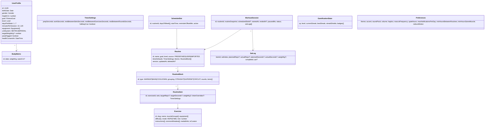

# 05 · Modelo de dominio y reglas de negocio

## 1. Modelo de dominio

**Enumeraciones**

| Enumeración | Valores |
|---|---|
| `FitnessGoal` | `LOSE_WEIGHT`, `ENDURANCE`, `MUSCLE_GAIN`, `STRENGTH`, `GENERAL_HEALTH` |
| `Level` | `BEGINNER`, `INTERMEDIATE`, `ADVANCED` |
| `Gender` | `MALE`, `FEMALE`, `OTHER`, `PREFER_NOT_TO_SAY` |
| `Equipment` | `NONE`, `DUMBBELLS`, `PULL_UP_BAR`, `BANDS`, `KETTLEBELL`, `BENCH`, `JUMP_ROPE`, `GYM` |
| `SessionStatus` | `IN_PROGRESS`, `PAUSED`, `COMPLETED`, `ABANDONED` |

**Eventos de dominio**

- `ProfileUpdated`
- `BodyWeightLogged`
- `RoutineCreated` / `RoutineUpdated` / `RoutineImported`
- `RoutineScheduled`
- `WorkoutSessionStarted` / `SetCompleted` / `WorkoutSessionCompleted` / `WorkoutSessionAbandoned`
- `PersonalRecordAchieved`
- `LevelUp`
- `BadgeUnlocked`
- `StreakExtended` / `StreakBroken` / `StreakShieldUsed`
- `InactivityDetected`

> La sesión guarda un **snapshot** de la rutina. Si la rutina se edita después, el historial no cambia.

## 2. Reglas de negocio (RN)

### RN-01 Edad
`edad = años completos entre birthDate y hoy`. Edad mínima de uso: 16 años (decisión D2, confirmada). Por debajo del mínimo se bloquea el registro con un mensaje amable.

### RN-02 IMC (índice de masa corporal)
`IMC = pesoKg / (estaturaM)²`, redondeado a 1 decimal. Categorías de la OMS para adultos:

| IMC | Categoría |
|---|---|
| < 18,5 | Bajo peso |
| 18,5 – 24,9 | Normal |
| 25,0 – 29,9 | Sobrepeso |
| ≥ 30,0 | Obesidad |

Siempre se muestra con el aviso de que es un indicador general.

### RN-03 TMB (tasa metabólica basal, Mifflin-St Jeor)
`TMB = 10·pesoKg + 6,25·estaturaCm − 5·edad + s`, donde `s` depende del género:

| Género | s |
|---|---|
| MALE | +5 |
| FEMALE | −161 |
| OTHER / PREFER_NOT_TO_SAY | −78 (promedio de ambos) |

El resultado se redondea a un número entero en kcal/día.

### RN-04 Calorías estimadas del ejercicio
`kcal = MET × 3,5 × pesoKg / 200 × minutosActivos`

Se suma por ejercicio usando solo el tiempo activo (fases de trabajo). Durante los descansos se usa MET = 1,5. Se muestra como "≈ estimado". Si el perfil no tiene peso, se usan 70 kg y se indica.

### RN-05 Precedencia de parámetros de tiempo
El valor efectivo de cada parámetro se toma del primer nivel que lo defina, en este orden: `RoutineItem.timerOverrides` → `Routine.timerDefaults` → `Preferences` globales → valores por defecto de la app.

Valores por defecto de la app:

| Parámetro | Valor |
|---|---|
| Preparación | 10 s |
| Trabajo (modo tiempo) | 40 s |
| Descanso entre series | 60 s |
| Descanso entre ejercicios | 90 s |
| Descanso entre rondas | 120 s |
| Aviso a mitad del intervalo | desactivado |

### RN-06 Límites de validación
| Campo | Mín | Máx | Paso |
|---|---|---|---|
| Series | 1 | 10 | 1 |
| Reps | 1 | 100 | 1 |
| Trabajo (s) | 5 | 600 | 5 |
| Descansos (s) | 0 | 600 | 5 |
| Preparación (s) | 0 | 30 | 1 |
| Rondas | 1 | 10 | 1 |
| Peso (kg) | 0 | 500 | 0,5 |
| Ejercicios por rutina | 1 | 40 | — |

### RN-07 Duración estimada de la rutina
`duración = prep + Σ(ejercicios)[ series × tActivo + (series − 1) × descansoSeries ] + (nEjercicios − 1) × descansoEjercicios + (rondas − 1) × descansoRondas`

- `tActivo` = `targetSeconds` si el ejercicio es por tiempo, o `targetReps × 3 s` si es por repeticiones (constante configurable).
- En circuitos y superseries no hay descanso entre los ejercicios del grupo: solo al final de cada ronda.

### RN-08 Sugerencia de progresión (doble progresión)
- Si en **2 sesiones consecutivas** se completan todas las series con `actualReps ≥ targetReps` y RPE ≤ 8 (o sin RPE): sugerir +1 rep por serie. Si ya se alcanzó el tope del rango del objetivo (RN-14), sugerir en su lugar +2,5 % de peso (mínimo +0,5 kg) y volver al inicio del rango de reps.
- Si en 2 sesiones consecutivas se completa < 70 % de las reps objetivo: sugerir −1 rep o −5 % de peso.
- La sugerencia **nunca** se aplica sola: el usuario la acepta o la descarta.

### RN-09 XP y niveles
`XP de la sesión = 50 (sesión completada) + minutosActivos (máx. 60) + 20 (si era una sesión programada iniciada en ±2 h) + 30 (por cada récord personal)`

- Sesión abandonada: `XP = minutosActivos`, sin bonos.
- Umbral acumulado para alcanzar el nivel `n`: `XP(n) = round(100 × n^1,5)`.

### RN-10 Racha
- La racha cuenta **días programados cumplidos consecutivos**.
- Un día programado se cumple con al menos una sesión completada (RN-11) ese día.
- Los días de descanso (sin programación) **no rompen** la racha.
- Una sesión en un día no programado suma XP y cuenta para la meta semanal, pero no altera la racha.
- La racha se evalúa al cierre del día local (00:00). Si un día programado no se cumplió y hay protectores, se consume uno (`StreakShieldUsed`). Si no hay, la racha vuelve a 0.

### RN-11 Sesión completada
Una sesión se considera completada si se marcó ≥ 80 % de las series planificadas. Por debajo de ese porcentaje queda `ABANDONED`, pero se guarda en el historial.

### RN-12 Adherencia
`adherencia semanal = días programados cumplidos / días programados de la semana`. Si no hay días programados, la adherencia no aplica y se muestra "sin plan".

### RN-13 Descanso mínimo
- Al programar o iniciar una rutina: si han pasado menos de `minHoursBetweenRoutines` horas desde la última sesión (0 por defecto, desactivado), se muestra una advertencia.
- Si la rutina trabaja un grupo muscular principal entrenado hace menos de `minHoursSameMuscle` horas (48 por defecto), se advierte y se sugiere una alternativa.
- La advertencia **no bloquea**, pero la sesión no otorga el bono de XP por programación.

### RN-14 Motor de propuesta de rutinas
Parámetros base por objetivo:

| Objetivo | Series | Reps | Descanso | Cardio | Estructura |
|---|---|---|---|---|---|
| LOSE_WEIGHT | 2–3 | 12–15 | 30–45 s | HIIT o intervalos, 15–20 min | Circuitos de cuerpo completo |
| ENDURANCE | 2–3 | 15–20 | 20–45 s | Continuo, 20–40 min | Circuitos + cardio |
| MUSCLE_GAIN | 3–4 | 8–12 | 60–90 s | 10 min suave | División por grupos |
| STRENGTH | 3–5 | 4–6 | 120–180 s | Opcional | Básicos compuestos |
| GENERAL_HEALTH | 2–3 | 10–15 | 45–60 s | 15 min moderado | Cuerpo completo + movilidad |

Ajustes por nivel:

- **BEGINNER:** límite inferior de series, +15 s de descanso y ejercicios de dificultad ≤ 2.
- **ADVANCED:** límite superior de series y variantes de dificultad 3.

División según los días por semana:

| Días | División |
|---|---|
| 1–3 | Cuerpo completo |
| 4 | Torso / pierna |
| 5–6 | Empuje / tirón / pierna + cuerpo completo |
| 7 | Se fuerza al menos 1 día de descanso |

Reglas finales:

- Solo se eligen ejercicios compatibles con el equipo disponible.
- La duración se ajusta a `minutesPerSession ± 10 %` usando RN-07.
- Si el cuestionario de aptitud salió positivo, solo se proponen rutinas BEGINNER y GENERAL_HEALTH hasta que el usuario confirme que tiene autorización médica.

### RN-15 Anti-abandono
| Situación | Acción |
|---|---|
| 1 día programado perdido | Notificación de reprogramación (1 vez) |
| 3 días sin sesión completada con plan activo | `InactivityDetected`: la mascota ofrece una **rutina express de 10 min** |
| 7 días | Propuesta de "vuelta suave": plan con −30 % de volumen durante 1 semana |
| 14 días | Un último mensaje amable. Después, no se envían más notificaciones de reactivación hasta que el usuario vuelva a abrir la app |

### RN-16 Notificaciones
- No más de `maxNotificationsPerDay` (3 por defecto). Los recordatorios de sesión y los avisos de intervalo durante una sesión activa no cuentan.
- Nada se envía en horas de silencio: el aviso se pospone al fin de ese periodo o se descarta si pierde sentido.
- Prioridad cuando hay límite: recordatorio de sesión > logro > reactivación > resumen.

### RN-17 Anti-trampa (v2)
El servidor rechaza para retos:

- sesiones con duración < suma de tiempos activos mínimos;
- más de 200 reps de un ejercicio en una serie;
- más de 6 h de entrenamiento al día;
- sesiones con fecha futura.

Los rechazos quedan registrados, pero la sesión se conserva en el historial personal.

### RN-18 Resolución de conflictos de sincronización
- Last-write-wins **por entidad**, usando `updatedAt` del servidor.
- Las eliminaciones son lógicas (`deletedAt`) y se propagan.
- `WorkoutSession` y `SetLog` son de solo agregar (inmutables una vez completadas), por lo que no generan conflictos.
