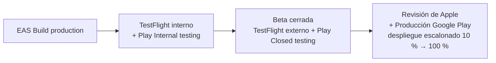

# 08 · Publicación en App Store y Google Play (MVP)

> Las políticas de las tiendas cambian con frecuencia. El agente `release-tiendas` debe verificar los requisitos vigentes en la documentación oficial de Apple y Google antes de cada envío.

## 1. Cuentas y configuración
- [ ] Cuenta de **Apple Developer Program** (pago anual) y cuenta de **Google Play Console** (pago único).
- [ ] Identificadores definitivos: `bundleIdentifier` (iOS) y `package` (Android), p. ej. `com.<empresa>.fitapp`. **No se pueden cambiar después de publicar.**
- [ ] Proyecto EAS configurado (`eas.json` con perfiles `development`, `preview` y `production`), firma gestionada por EAS y secretos en EAS.
- [ ] Versionado: `version` semver visible (1.0.0) y `buildNumber` / `versionCode` autoincrementados por EAS.

## 2. Requisitos de producto que exigen las tiendas
| Requisito | Dónde se cubre |
|---|---|
| Eliminación de cuenta desde la app (Apple y Google) y, en Google, también desde una URL web | RF-01.08 + página web de solicitud |
| Política de privacidad pública (URL) y enlace dentro de la app | RF-01.07 |
| Declaración de seguridad de los datos (Google Play Data Safety) y etiquetas de privacidad de App Store | Inventario de datos del agente de seguridad |
| Declaración de apps de salud en Google Play (si aplica a la categoría) | Checklist de release |
| Permiso de notificaciones solicitado en contexto (tras explicar para qué sirve), nunca al abrir la app | F04 |
| Si hay login social de terceros en iOS: ofrecer también Iniciar sesión con Apple | RF-01.10 (v1.1) |
| Aviso de que no es un dispositivo médico; sin afirmaciones médicas en la ficha | RNF-20 |
| Uso de datos de salud (HealthKit / Health Connect) con justificación | v1.1 |
| Target API level de Android exigido por Google Play vigente | Configuración de Expo SDK |
| Clasificación de contenido (cuestionario IARC en Google; clasificación por edades en Apple) | Ficha |

## 3. Ficha de tienda
- [ ] Nombre, subtítulo, descripción corta y larga (es-CO; en-US en v1.1).
- [ ] Ícono 1024×1024, capturas para teléfonos (y tablet si se declara soporte), gráfico destacado de Google Play (1024×500).
- [ ] Categoría: Salud y bienestar / Health & Fitness.
- [ ] Palabras clave, URL de soporte y email de contacto.
- [ ] Cuenta demo para el revisor de Apple (usuario y contraseña) con datos precargados.

## 4. Ruta de lanzamiento

- [ ] **Google Play, cuentas personales nuevas:** Google exige una prueba cerrada con un número mínimo de testers durante un periodo mínimo antes de habilitar producción (al momento de redactar: 12 testers durante 14 días; verificar vigencia). Planificarlo en el hito H5.
- [ ] Beta cerrada con ≥ 20 usuarios reales. Criterio de salida: ≥ 99,5 % de sesiones sin crash y ningún bug bloqueante abierto.
- [ ] Despliegue escalonado en Google Play y lanzamiento por fases en App Store.
- [ ] Actualizaciones OTA (EAS Update) solo para correcciones de JS que no cambien la naturaleza de la app.

## 5. Checklist técnico previo al envío
- [ ] Sin logs de depuración ni endpoints de staging en el build de producción.
- [ ] Sentry configurado con source maps.
- [ ] Deep links y enlaces universales verificados.
- [ ] Notificaciones probadas en iOS y Android: permisos, canales de Android y acciones.
- [ ] Prueba de la sesión de 60 min con pantalla bloqueada (RNF-03).
- [ ] Accesibilidad revisada con VoiceOver y TalkBack.
- [ ] Todos los medios con licencia de uso comercial (imágenes, videos, sonidos, fuentes y animaciones de la mascota).
