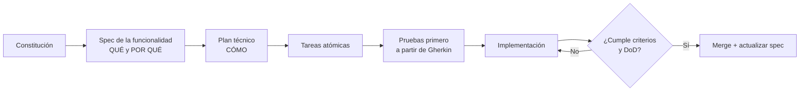

# FitApp — Paquete de especificaciones (Spec-Driven Development)

> **FitApp** es un nombre en clave. Reemplácelo cuando se defina la marca.

App móvil multiplataforma (iOS y Android) de salud y ejercicio diario. El usuario puede:

- usar rutinas predefinidas o crear e importar las suyas según su objetivo;
- programar sus sesiones y recibir avisos;
- entrenar con cronómetros parametrizables;
- registrar su progreso;
- mantenerse motivado con gamificación y una mascota entrenadora.

Este paquete es la **fuente de verdad** del producto. El código se escribe *a partir* de estas specs, nunca al revés.

---

## 1. Estructura del paquete

```
fitapp-specs/
├── README.md                          ← este archivo (índice y forma de uso)
├── CLAUDE.md                          ← contexto raíz que leen los agentes
├── 00-constitucion.md                 ← principios NO negociables
├── 01-vision-alcance-roadmap.md       ← visión, usuarios, MVP y versiones
├── 02-requerimientos-funcionales.md   ← catálogo de RF con ID, prioridad y versión
├── 03-requerimientos-no-funcionales.md← rendimiento, seguridad, privacidad, accesibilidad
├── 04-arquitectura.md                 ← arquitectura limpia móvil + backend Java
├── 05-modelo-dominio-reglas.md        ← entidades y reglas de negocio (RN) con fórmulas
├── 06-contratos-api.md                ← API REST v1, sincronización y errores
├── 07-estrategia-pruebas.md           ← pirámide, TDD, cobertura y Definition of Done
├── 08-publicacion-tiendas.md          ← checklist App Store / Google Play
├── specs/                             ← una spec por funcionalidad (F01…F10)
├── agents/                            ← definición de agentes especializados
└── templates/                         ← plantillas de spec, plan, tareas y ADR
```

## 2. Flujo de trabajo SDD



1. **Constitución** (`00-constitucion.md`). Se lee siempre antes de cualquier tarea.
2. **Spec** (`specs/Fxx-*/spec.md`). Describe comportamiento observable y criterios de aceptación en Gherkin. No habla de implementación.
3. **Plan** (`specs/Fxx-*/plan.md`). Lo genera el agente arquitecto con `templates/plan-template.md` e indica capas, archivos, contratos y riesgos.
4. **Tareas** (`specs/Fxx-*/tasks.md`). Pasos pequeños, ordenados y verificables, generados con `templates/tasks-template.md`.
5. **Implementación con TDD**. Cada criterio de aceptación se convierte en al menos una prueba.
6. **Verificación**. El agente QA contrasta el resultado con la spec y la Definition of Done.

> El flujo es compatible con **GitHub Spec Kit** (`/specify`, `/plan`, `/tasks`) y con cualquier agente de código. Si usa Spec Kit, copie `00-constitucion.md` como constitución del proyecto.

## 3. Convención de identificadores (trazabilidad)

| Prefijo | Significado | Ejemplo |
|---|---|---|
| `F01…F10` | Funcionalidad (feature) | F05 Sesión de entrenamiento |
| `RF-05.02` | Requerimiento funcional 02 de F05 | Motor de temporizador |
| `RNF-xx` | Requerimiento no funcional | RNF-03 Precisión del cronómetro |
| `RN-xx` | Regla de negocio / dominio | RN-05 Precedencia de tiempos |
| `CA-05.02.1` | Criterio de aceptación 1 de RF-05.02 | — |
| `ADR-xxx` | Decisión de arquitectura | ADR-001 Expo + EAS |

Las pruebas **deben** citar el ID que verifican:

```ts
describe('RF-05.02 Motor de temporizador', () => {
  it('CA-05.02.1 pasa de TRABAJO a DESCANSO al llegar a 0', () => { /* ... */ });
});
```

## 4. Uso de los agentes

Los archivos de `agents/` usan el formato de subagentes de Claude Code (frontmatter YAML y prompt de sistema).

- **Claude Code:** copie `agents/*.md` a `.claude/agents/` y `CLAUDE.md` a la raíz del repositorio.
- **Otras herramientas** (Cursor, Copilot, Codex, etc.): use el cuerpo de cada archivo como instrucciones del agente o modo personalizado.

| Agente | Responsabilidad principal |
|---|---|
| `orquestador` | Coordina el flujo SDD, divide trabajo y verifica la DoD |
| `analista-producto` | Escribe y refina specs y criterios Gherkin |
| `arquitecto` | Genera planes, ADR y protege las reglas de dependencia |
| `dev-mobile-rn` | Implementa en React Native (TypeScript) |
| `dev-backend-java` | Implementa en Java / Spring Boot |
| `qa-pruebas` | Escribe pruebas desde los criterios y valida cobertura |
| `ux-motivacion` | Diseña estados de UI, animaciones, mascota, sonidos y accesibilidad |
| `seguridad-privacidad` | Revisa datos de salud, OWASP MASVS y la Ley 1581 |
| `release-tiendas` | Gestiona builds, versiones, CI/CD y publicación en tiendas |

## 5. Decisiones abiertas (confirmar con el dueño del producto)

| # | Decisión | Propuesta por defecto |
|---|---|---|
| D1 | Nombre y marca de la app | Pendiente |
| D2 | Edad mínima de uso | 16 años (evita el régimen de datos de menores) |
| D3 | Mascota en el MVP | Sí, versión básica con 5 estados (ver F09) |
| D4 | Temas en el MVP | Claro, oscuro, sistema y 4 colores de acento. La personalización completa llega en v1.1 |
| D5 | Proveedor de hosting del backend | Contenedor Docker en cualquier nube (AWS, GCP, Render o Fly) |
| D6 | Monetización | Gratuita en el MVP; freemium a evaluar en v3 |
| D7 | Idiomas | Español en el MVP; inglés en v1.1 (i18n listo desde el día 1) |
| D8 | Login social (Google/Apple) | v1.1. Si se agrega Google en iOS, es obligatorio ofrecer también Iniciar sesión con Apple |
