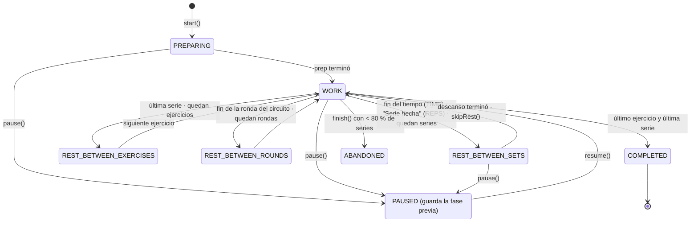

# F05 · Sesión de entrenamiento y cronómetros

| Campo | Valor |
|---|---|
| Versión | MVP 1.0 — **núcleo del producto** |
| RF | RF-05.01 … RF-05.11 |
| Reglas | RN-04, RN-05, RN-06, RN-08, RN-09, RN-11 |
| RNF críticos | RNF-03 (precisión), RNF-04 (offline), RNF-10 (accesibilidad), RNF-12 (batería) |
| Módulos | `features/workout-session`; puertos `Clock`, `SoundPlayer`, `Haptics`, `KeepAwake`, `NotificationScheduler`, `SessionRepository` |

## Objetivo
Guiar la sesión de principio a fin **sin que el usuario tenga que mirar el reloj**. La app indica cuánto dura cada ejercicio, cuánto descansar y qué viene después, y permite registrar lo que realmente hizo.

## Historias de usuario
- **HU-05.1** Como usuario, quiero un cronómetro que me indique cuánto dura el ejercicio y cuánto debo descansar.
- **HU-05.2** Como usuario, quiero parametrizar los tiempos de trabajo y descanso.
- **HU-05.3** Como usuario, quiero marcar los ejercicios completados y subir o bajar las repeticiones hechas.
- **HU-05.4** Como usuario, quiero que el cronómetro siga funcionando si bloqueo el teléfono.
- **HU-05.5** Como usuario, quiero ver un resumen y mi recompensa al terminar.

## Máquina de estados del temporizador


### Contrato del dominio (TypeScript, orientativo)
```ts
type PhaseKind = 'PREPARING' | 'WORK' | 'REST_BETWEEN_SETS' | 'REST_BETWEEN_EXERCISES'
               | 'REST_BETWEEN_ROUNDS' | 'PAUSED' | 'COMPLETED' | 'ABANDONED';

interface TimerSnapshot {
  phase: PhaseKind;
  cursor: { blockIdx: number; itemIdx: number; setIdx: number; round: number };
  phaseStartedAt: number;      // epoch ms
  phaseDurationMs: number | null; // null = cronómetro ascendente (WORK en modo REPS)
  pausedAccumulatedMs: number;
}

class TimerEngine {                              // puro: sin setInterval ni Date.now
  static start(routine: RoutineSnapshot, globals: TimerSettings, now: number): TimerEngine;
  tick(now: number): { snapshot: TimerSnapshot; cues: Cue[] };  // cues: COUNTDOWN_3/2/1, PHASE_CHANGE, HALFWAY
  completeSet(now: number, log: SetResult): TimerEngine;
  pause(now: number): TimerEngine;
  resume(now: number): TimerEngine;
  skipRest(now: number): TimerEngine;
  adjustRest(now: number, deltaSeconds: 15 | -15): TimerEngine;
  goTo(now: number, target: 'NEXT_EXERCISE' | 'PREVIOUS_EXERCISE'): TimerEngine;
  remainingMs(now: number): number | null;
  upcomingPhaseEnds(now: number, horizon: number): number[];   // para programar notificaciones en segundo plano
}
```
- El tiempo restante siempre se calcula como `phaseStartedAt + phaseDurationMs + pausas − now`. **Nunca** se decrementa un contador.
- La UI llama a `tick(clock.now())` a ≤ 4 Hz mediante `requestAnimationFrame` o un intervalo, y reproduce los `cues`.

## Pantalla de sesión (layout)
- **Arriba:** progreso de la rutina (ejercicio 3/8 · serie 2/4) y tiempo total transcurrido.
- **Centro:** anillo de progreso con el tiempo grande (trabajo en color de acento, descanso en color secundario), nombre del ejercicio, animación o video, y reps y peso objetivo.
- **Controles:** `−` reps `+`, `−` peso `+`, botón principal contextual (Iniciar / Serie hecha / Saltar descanso), `+15 s`, `−15 s`, Pausa.
- **Abajo:** "Siguiente: Sentadilla goblet 4×12". La mascota aparece al inicio de cada ejercicio y en los descansos (F09).
- Durante el descanso: `REST` a pantalla completa, con cuenta regresiva y vista previa del siguiente ejercicio.

## Criterios de aceptación
```gherkin
  Escenario: CA-05.01.1 Vista previa e inicio
    Cuando abro una rutina y pulso "Empezar"
    Entonces veo la lista de ejercicios con la duración estimada
    Y al confirmar comienza PREPARING con la cuenta regresiva configurada

  Escenario: CA-05.02.1 Ejercicio por tiempo
    Dado un ejercicio TIME de 40 s con 3 series y 20 s de descanso entre series
    Cuando transcurren 40 s en WORK
    Entonces la fase cambia a REST_BETWEEN_SETS de 20 s
    Y la serie 1 se marca como completada con actualSeconds = 40

  Escenario: CA-05.02.2 Ejercicio por repeticiones
    Dado un ejercicio REPS de 3×12
    Entonces WORK muestra un cronómetro ascendente y el botón "Serie hecha"
    Y al pulsarlo, la serie se registra con actualReps = 12 (editable) y empieza el descanso

  Escenario: CA-05.02.3 Precedencia de parámetros (RN-05)
    Dado global rest 90 s, rutina rest 60 s y override del ítem rest 30 s
    Entonces el descanso entre series de ese ítem es 30 s

  Escenario: CA-05.02.4 Circuito
    Dado un circuito de 3 ejercicios × 2 rondas con descanso entre rondas de 90 s
    Entonces no hay descanso entre los ejercicios del circuito
    Y tras el tercer ejercicio de la ronda 1 hay REST_BETWEEN_ROUNDS de 90 s

  Escenario: CA-05.04.1 Señales
    Dado sonido y vibración activados
    Cuando faltan 3, 2 y 1 s para terminar una fase
    Entonces suena un bip corto y hay vibración ligera en cada segundo
    Y al cambiar de fase suena un tono distinto para WORK y para REST
    Y un anuncio accesible indica el nombre de la nueva fase

  Escenario: CA-05.04.2 Modo silencioso
    Dado que el sonido de la app está desactivado
    Entonces las señales se dan solo con vibración y un destello visual del anillo

  Escenario: CA-05.05.1 Pausar y reanudar
    Dado un descanso con 25 s restantes
    Cuando pauso durante 2 min y reanudo
    Entonces el descanso continúa con 25 s restantes
    Y el tiempo en pausa no cuenta como tiempo activo

  Escenario: CA-05.05.2 Ajustar el descanso
    Dado un descanso con 20 s restantes
    Cuando pulso "+15 s"
    Entonces quedan 35 s
    Y "−15 s" nunca deja el descanso por debajo de 0 (se salta)

  Escenario: CA-05.06.1 Ajustar reps y peso
    Cuando en la serie actual pulso "−" dos veces en reps y "+" una vez en peso (paso 0,5 kg)
    Entonces la serie se registra con actualReps = objetivo − 2 y weightKg = peso + 0,5

  Escenario: CA-05.06.2 Marcar o desmarcar desde la lista
    Cuando abro la lista de ejercicios durante la sesión
    Entonces puedo marcar o desmarcar series como completadas
    Y el porcentaje de completado se actualiza

  Escenario: CA-05.07.1 Segundo plano
    Dado una fase WORK con 30 s restantes
    Cuando bloqueo el teléfono
    Entonces se programan notificaciones locales para los finales de fase de los próximos 15 min
    Y al desbloquear a los 50 s, la app muestra la fase correcta con desviación ≤ 1 s

  Escenario: CA-05.07.2 Pantalla activa
    Mientras la sesión está en curso y la app en primer plano
    Entonces la pantalla no se apaga
    Y al terminar o pausar más de 5 min se libera el keep-awake

  Escenario: CA-05.09.1 Resumen
    Cuando termino la sesión con ≥ 80 % de las series
    Entonces el estado es COMPLETED
    Y veo duración, series completadas, volumen (Σ reps × kg), kcal estimadas (RN-04), XP (RN-09) y récords
    Y se emite WorkoutSessionCompleted
    Y la mascota celebra (F09) con confeti (F07)

  Escenario: CA-05.09.2 Terminar antes
    Cuando pulso "Terminar" con menos del 80 % de las series
    Entonces se me pide confirmación
    Y la sesión se guarda como ABANDONED con su XP parcial

  Escenario: CA-05.10.1 Recuperar sesión
    Dado que la app se cerró con una sesión IN_PROGRESS hace menos de 3 h
    Cuando vuelvo a abrir la app
    Entonces veo "¿Continuar tu sesión?" con opciones Continuar y Terminar
    Y si pasaron más de 3 h, la sesión se cierra automáticamente según RN-11

  Escenario: CA-05.11.1 Sugerencia de progresión (RN-08)
    Dado que en las 2 últimas sesiones completé 4×12 de "Curl de bíceps" con 10 kg
    Cuando termino la sesión
    Entonces el resumen sugiere "Sube a 10,5 kg" o "+1 rep" según el rango del objetivo
    Y solo se aplica a la rutina si pulso "Aplicar"
```

## Persistencia
- El snapshot del temporizador y los `SetLog` se guardan en SQLite **en cada transición de fase y en cada serie**, para poder recuperar la sesión (CA-05.10.1).
- La sesión guarda un `routineSnapshot` inmutable.

## Accesibilidad
- Tiempo restante anunciado cada 10 s en el descanso con el lector de pantalla.
- Botones con etiquetas ("Aumentar repeticiones, actual 12").
- Anillo con contraste AA; animaciones sustituidas por transiciones simples si "reducir movimiento" está activo.

## Fuera de alcance
Voz guía TTS (v1.1), Live Activities y controles en la pantalla de bloqueo (v1.1), reloj inteligente.
